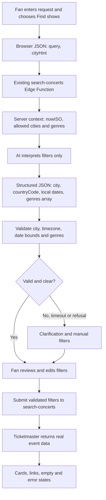

# Concert Finder — POC stack and production architecture

**Decision:** Use Lovable and Google Antigravity to build the existing React frontend through one GitHub repository. Host that frontend on Netlify; keep the existing Supabase `search-concerts` Edge Function as the backend. Add server-side AI interpretation before searching real Ticketmaster listings. Keep filters visible and editable. **If we have time:** add Spotify sign-in and a small top-artist discovery test; neither is required for guest search or the core POC.

**Product test:** Can “punk-ish rock in Montréal this weekend” get a fan to a relevant real event faster than manually selecting city, genre and dates? Measure task start to first relevant provider-link open, including filter corrections. A click is not a ticket purchase.

## POC technology choices

| Layer | Choice | Why for this POC |
| --- | --- | --- |
| Frontend | Existing Lovable app (React/TypeScript) with its configured Supabase client | Reuse the working search screen; show accessible editable filters and real event cards. Lovable is a **build tool**, not the runtime AI parser. |
| Development and version control | Google Antigravity for coding, debugging and local tests; Lovable for UI iteration; one GitHub repository | Familiar tools speed up edits. Push and review changes through a single branch/workflow to avoid divergent Lovable and local versions. [Lovable GitHub sync](https://docs.lovable.dev/integrations/github); [Antigravity IDE](https://antigravity.google/docs/home). |
| Backend | Extend the existing Supabase Edge Function `search-concerts` | Keeps provider and AI credentials server-side and preserves the configured client invocation. Do not create a new function just to parse a prompt. |
| Runtime AI | A small API model with strict structured output, called from the Edge Function; OpenAI Responses API with `text.format` is one concrete choice | **ChatGPT and Antigravity are tools for you to work with; the deployed app needs its own API credentials and per-call costs.** The model generates *candidate filters only*. A manual-filter fallback covers timeout or ambiguity. [Structured Outputs](https://developers.openai.com/api/docs/guides/structured-outputs); [Responses format guidance](https://developers.openai.com/api/docs/guides/migrate-to-responses). |
| Concert data | Ticketmaster Discovery API through the Edge Function | The existing provider supplies actual event IDs, venues, dates and outbound links. Its published API page states 5,000 calls/day and 5/second while its FAQ states 2/second; throttle conservatively and confirm the project's allowance. [API documentation](https://developer.ticketmaster.com/products-and-docs/apis/discovery-api/v2/); [FAQ](https://developer.ticketmaster.com/support/faq/). |
| Spotify — **if we have time** | Supabase Auth with Spotify OAuth; optionally request `user-top-read` and match a bounded list of top artists to real Ticketmaster shows | After core guest search passes, test with allowlisted accounts and show up to five actual upcoming matches, or a useful no-match state. Keep listening data and tokens off Airtable. Development-mode access is limited; see constraints below. |
| Database | No new table for the first five-user search test; Supabase Postgres when account and product analytics are added | A real-time concert catalogue is supplied by Ticketmaster. Supabase Auth provides accounts later; store consented product events and `search_journey_id`/`search_id` in Postgres when instrumentation is ready. |
| File storage | None for the POC | Provider event artwork comes from event URLs; no user-uploaded media. Supabase Storage is available later if users upload files, after a specific use case is defined. |
| Vector store | None | Filter interpretation and provider lookup do not retrieve from a document corpus. Add embeddings/vector search only for a proven semantic catalogue or RAG need. |
| Hosting | Netlify for the static Vite/React frontend; Supabase hosts Edge Functions | Connect the GitHub repo to Netlify, use `npm run build` and `dist` if the repo is Vite. Use the default Netlify URL for the POC; Lovable can keep a separate preview. [Lovable external hosting](https://docs.lovable.dev/tips-tricks/external-deployment-hosting); [Netlify Vite setup](https://docs.netlify.com/build/frameworks/framework-setup-guides/vite/). |
| Secrets and operations | Supabase Edge Function secrets for Ticketmaster and model keys; limited operational logs | Do not expose provider keys, Supabase service-role keys or raw query logs in frontend code or source control. [Supabase secrets](https://supabase.com/docs/guides/functions/secrets). |

**Why this stack:** You already have the frontend and a working backend entry point; Lovable and Antigravity are familiar and fast for a two-day build. GitHub makes the source of truth portable; Netlify and Supabase avoid building hosting, auth and server infrastructure from scratch. The real differentiator is the one-request-to-editable-filters experience, so extra storage systems would slow down the test.

**Hosting choice:** Netlify is a reasonable deployment target; it does not replace the Supabase backend. Use the Netlify-provided URL for this POC and keep the existing Lovable URL as a preview while deployment is configured. If Spotify is added, register the exact deployed OAuth redirect URLs in Spotify and Supabase before testing sign-in. Custom domain setup can wait.

**Contract decision:** The existing `search-concerts` call accepts `{ keyword, city, size: 10, page: 0 }`. Preserve that contract and first inspect an actual response before changing card mapping. Add an optional `mode: "interpret"` with `{ query, cityHint? }` that returns validated `appliedFilters`; add an optional `mode: "search"` for edited filters. Legacy requests keep working. If the current function already supports an equivalent contract, adapt to it rather than changing it gratuitously. The AI's JSON is never treated as a concert event.

### POC architecture and AI placement

The AI step is **between the fan's sentence and the editable filters**, before the Ticketmaster call. Input is request JSON `{ query: string, cityHint?: string }` plus server context `{ nowISO, allowedCities, allowedGenres }`; never pass API keys to the model. Output is schema-constrained JSON `{ city, countryCode, startLocalDate, endLocalDate, genres[] }` plus a clarification flag; date interpretation uses the chosen city's time zone. Reject unsupported cities, genre values and date windows. On timeout or invalid output, show manual filters and a useful message. Only the Ticketmaster response can create a result card. Deduplicate by provider event ID, label source coverage, and expose clear empty, error and rate-limit states.

## Constraints beyond model tokens

| Constraint | POC decision |
| --- | --- |
| Spotify access — optional | **If time remains after core search and the 60-second task test**, try Spotify sign-in and top-artist discovery with allowlisted testers. Spotify development mode currently supports up to **five allowlisted authenticated users** and requires the app owner to have Spotify Premium. Wider public use requires an extended quota application with substantial eligibility requirements; do not make Spotify a prerequisite for guest search or the core demo. [Spotify quota modes](https://developer.spotify.com/documentation/web-api/concepts/quota-modes). |
| Event-source coverage and limits | Ticketmaster misses some local shows and may have incomplete genre tags; cache or throttle repeated searches. Its API page and FAQ differ on the per-second default, so stay below the lower published value until the account's quota is confirmed. [Ticketmaster API](https://developer.ticketmaster.com/products-and-docs/apis/discovery-api/v2/); [FAQ](https://developer.ticketmaster.com/support/faq/). |
| AI latency, errors and cost | Bound the input and output, set a timeout and limit retries. Use manual filters as fallback. The 5-second search-response target includes model and provider time in the actual user flow. API usage has separate cost from a ChatGPT subscription or Antigravity coding allowance. |
| Date and relevance quality | Resolve “this weekend” in the selected city's time zone; allow filter corrections. Search relevance depends on Ticketmaster coverage and classification, not only the AI interpretation. |
| Privacy and security | Guest search avoids unnecessary login. Define consent/lawful basis before persistent search analytics, minimize location and query history, and keep credentials server-side. |
| Version and deployment drift | Keep GitHub as the canonical code path between Lovable, Antigravity and Netlify; verify that the actual Edge Function request/response matches the deployed frontend. Configure the correct deployed callback URLs before optional OAuth testing. |

**Why AI matters:** Rules can recognize a few fixed requests, but fans describe similar sounds and time windows in many ways. An interpreter can turn “punk-ish rock in Montréal this weekend” into editable city, date and adjacent-genre filters without forcing the fan to know Ticketmaster's genre vocabulary. This is a hypothesis to test, not a promise that AI will improve relevance.

**POC test gates:** Real `jazz` + `New York` search and event link work before AI is added; try `rock` + `Montreal` next. For five scripted natural-language searches, at least 80% return understandable results or a useful empty state; invented cards remain zero; response target is under five seconds under normal upstream conditions. Compare search-to-relevant-open against a conventional filter flow, target under 60 seconds, and log filter corrections in the test sheet. At 200% zoom, perform the entire task with keyboard only.

## Production-grade sketch

Retain the same search journey and event grounding. Add reliable identity, search observability and background reporting once the POC shows value.

```mermaid
flowchart TB
    A["Accessible web app"] --> B["API and auth boundary"]
    B --> C["Search orchestrator"]
    C --> D["AI intent service: schema and fallback"]
    C --> E["Event-source adapters and cache"]
    E --> F["Ticketmaster and licensed sources"]
    B --> G["Supabase Auth + Postgres with RLS"]
    B --> H["Product-event collector"]
    H --> G
    G --> I["Background aggregate and sync jobs"]
    I --> J["Restricted Airtable reporting views"]
```

| Production capability | Design choice |
| --- | --- |
| Identity and Spotify | Keep guest search. Add Supabase Auth with Spotify sign-in; request `user-top-read` separately for the optional “shows from my top artists” feature. A trusted server gets a bounded top-artist list and matches it to real event listings; show *up to* five upcoming matches. Do not send Spotify tokens or artist history to Airtable. [Supabase Spotify login](https://supabase.com/docs/guides/auth/social-login/auth-spotify); [Spotify top items](https://developer.spotify.com/documentation/web-api/reference/get-users-top-artists-and-tracks). |
| API and event sources | Put input validation, city/time-zone resolution, cache, quotas, timeout budgets, deduplication and provider attribution behind one backend contract. Add other providers only after licensed access is secured; keep the client unaware of individual source APIs. |
| AI controls | Version prompts and schemas; use an allowlist, confidence/clarification path, timeouts and fallback. Evaluate genre and date interpretation against saved test prompts and compare the fan's filter-correction rate. Never accept a model-generated event as inventory. |
| Product analytics | Create `search_journey_id` on first input, `search_id` on each submit and a monotonic client duration from journey start to first outbound provider click. Include result count, empty/error status, filter corrections and event ID. Record no-open journeys separately; do not infer purchases. |
| Durable storage and access | Make Supabase Postgres the source of truth for approved product events, search metadata and profiles. Enforce least-privilege access and Row Level Security; keep service credentials in trusted services. [Supabase RLS guide](https://supabase.com/docs/guides/database/postgres/row-level-security). |
| Reporting | Queue or schedule aggregates and approved search records to Airtable using a server-side credential. Idempotently upsert by `search_id`, batch and retry with backoff. Do not block results or event opens when Airtable is down. Check Airtable plan and API capacity before syncing every search. [Airtable API limits](https://support.airtable.com/articles/7735693959-managing-api-call-limits-in-airtable). |
| Privacy and accessibility | Decide lawful basis and consent for optional tracking before enabling it; minimize stored queries and location, set deletion/retention rules across both stores, and restrict reporting access. Keep visible labels, keyboard navigation, focus, contrast and 200% zoom support in login and search flows. |

**Sequence of investment:** (1) Prove live search and AI interpretation with editable filters. (2) Test time to open a relevant event against manual filters. **If time remains:** test Spotify sign-in and up to five real top-artist shows with allowlisted accounts. (3) Add durable search-to-open instrumentation, asynchronous Airtable reporting and additional event sources only when usage and data rights justify them.

**Open implementation check:** Inspect the deployed Edge Function's real request and response before modifying it. The current README's `{ keyword, city, size, page }` payload differs from the PRD's proposed `{ city, countryCode, genres, startDateTime, endDateTime }`; normalize that contract deliberately, without assuming the aspirational fields already work.
